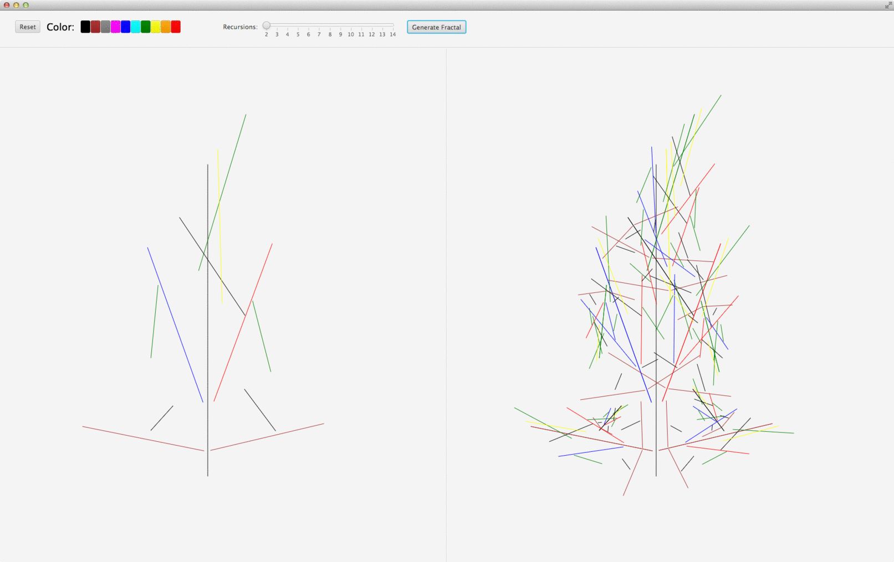

# JavaFX Fractal Application

### Usage

The idea is to define a set of lines that will form a geometric pattern for the application to eventually apply
self-similarity to the rest of them in order to generate the fractal.

1. Draw these pattern `lines` on your screen (patterns) through mouse clicks. First mouse click sets the start of a line,
second click the end of the same line and repeat.
2. Optionally for each line the color may be preset through the **color toggle group control**.
3. Select the number of `recursions` with the respective slider control to view the corresponding fractal.

*As a warning, it is better not to define too many lines in the pattern (5 should be fine), nor higher recursion levels
(no more than 7 for a 5 line pattern); as the recursion is memory and processing intensive and the application is prone
to crash if the fractal is too big.*

### Implementation

- This client application links the [Fractal Library](https://github.com/marco-ruiz/fractal-framework) as a subproject,
to provide the computational aspects of generating the fractal.
- For that reason the cloning of this project must include the `--recursive` option.