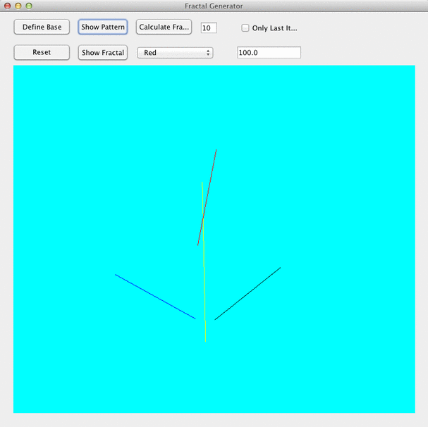

# Java Swing Fractal Application

### Installation

From the command line issue the following commands:

1. `cd [DIRECTORY WHERE TO DOWNLOAD PROJECT DIRECTORY]` : to move into the working directory
2. `git clone --recursive [CLONE REPOSITORY URL]` : to clone the project's repository
3. `cd fractal-swing/` : to move into the sub-directory of the project just cloned
4. `./gradlew runApp` : to compile and run the application

At this point the Java Swing application will launch in a window ready to be used to generate fractals.

### Usage

The idea is to define a set of lines that will form a geometric pattern for the application to eventually apply
self-similarity to the rest of them in order to generate the fractal.

1. Draw these pattern `lines` on your screen (patterns) through mouse clicks. First mouse click sets the start of a line,
second click the end of the same line and repeat.
2. Optionally for each line the color may be preset through the **color dropdown control**.
3. Set the number of `recursions` in the text field next to the `Calculate Fractal` button.
4. Once ready to see the fractal corresponding to the pattern drawn, press the `Calculate Fractal`.
5. Then press the `Show Fractal` button to switch between the pattern (or base) and the generated fractal.

*As a warning, it is better not to define too many lines in the pattern (5 should be fine), nor higher recursion levels
(no more than 7 for a 5 line pattern); as the recursion is memory and processing intensive and the application is prone
to crash if the fractal is too big.*

### Implementation

- This client application links the [Fractal Library](https://github.com/marco-ruiz/fractal-framework) as a subproject,
to provide the computational aspects of generating the fractal.
- For that reason the cloning of this project must include the `--recursive` option.